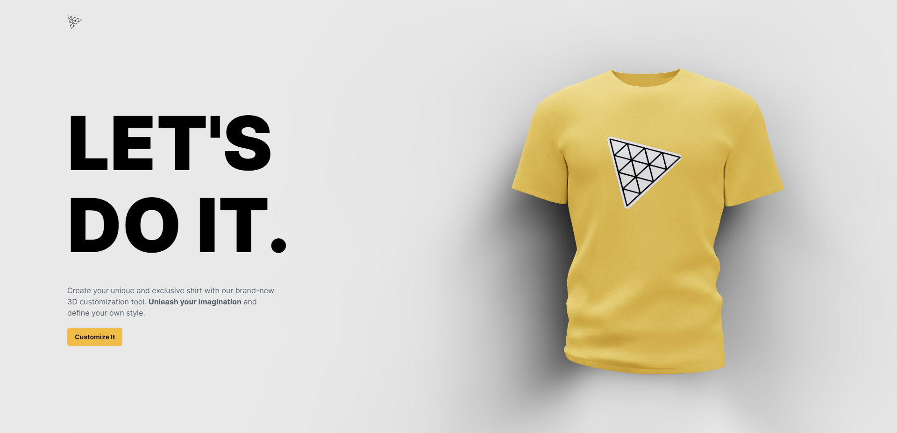

<a name="readme-top"></a>
<div align="center">

  
  

  <h1>AI-Powered 3D Product Web</h1>
  
  <p>
    Create your unique and exclusive shirt with brand-new 3D customization tool. Unleash your imagination and define your own style.
  </p>

<!-- Badges -->
<p>
  <a href="https://github.com/ladunjexa/AI-Powered-3D-Product-Web/graphs/contributors">
    
  </a>
  <a href="">
    
  </a>
  <a href="https://github.com/ladunjexa/AI-Powered-3D-Product-Web/network/members">
    
  </a>
  <a href="https://github.com/ladunjexa/AI-Powered-3D-Product-Web/stargazers">
    
  </a>
  <a href="https://github.com/ladunjexa/AI-Powered-3D-Product-Web/issues/">
    
  </a>
  <a href="https://github.com/ladunjexa/AI-Powered-3D-Product-Web/blob/master/LICENSE">
    
  </a>
</p>
   
 <h4>
    <a href="https://ai-powered-3-d-product-web.vercel.app/">View Demo</a>
  <span> · </span>
    <a href="https://github.com/ladunjexa/AI-Powered-3D-Product-Web">Documentation</a>
  <span> · </span>
    <a href="https://github.com/ladunjexa/AI-Powered-3D-Product-Web/issues/">Report Bug</a>
  <span> · </span>
    <a href="https://github.com/ladunjexa/AI-Powered-3D-Product-Web/issues/">Request Feature</a>
  </h4>
</div>

<br />

<!-- Table of Contents -->
<details>

<summary>

# :notebook_with_decorative_cover: Table of Contents

</summary>

- [About the Project](#star2-about-the-project)
  * [Folder Structure](#bangbang-folder-structure)
  * [Tech Stack](#space_invader-tech-stack)
- [Getting Started](#toolbox-getting-started)
  * [Installation](#gear-installation)
  * [Run Locally](#running-run-locally)
- [Contributing](#wave-contributing)
- [License](#warning-license)
- [Contact](#handshake-contact)
- [Acknowledgements](#gem-acknowledgements)

</details>  

<!-- About the Project -->
## :star2: About the Project

<div align="center">
  
</div>

<br />
This repository houses an stunning ThreeJS 3D Product website corporate with the incredible power of artificial intelligence built with React & Three.js and OpenAI Api.

<!-- Folder Structure -->
### :bangbang: Folder Structure

Here is the folder structure of webapp.
```bash
AI-Powered-3D-Product-Web/
|- client/
  |-- public/
  |-- src/
    |-- assets/
    |-- canvas/
    |-- components/
    |-- config/
    |-- pages/
    |-- store/
|- server/
  |-- routes/
```
<br />

<!-- TechStack -->
### :space_invader: Tech Stack

[](https://skillicons.dev)

<p align="right">(<a href="#readme-top">back to top</a>)</p>

<!-- Getting Started -->
## :toolbox: Getting Started

<!-- Installation -->
### :gear: Installation

#### Step 1:
Download or clone this repo by using the command below:

```bash
 https://github.com/ladunjexa/AI-Powered-3D-Product-Web.git
```

#### Step 2:

This webapp using NPM (Node Package Manager), therefore, make sure that Node.js is installed by execute the following command in console:

```bash
  node -v
```

#### Step 3:

In both folders (`client` / `server`) execute the following command to get the required packages:

```bash
  npm install
```

<!-- Run Locally -->
### :running: Run Locally

#### Step 1:

Go to `server` folder and execute the following command in order to start the server:

```bash
  npm start
```

#### Step 2

Go to `client` folder and execute the following command in order to run the web application:

```bash
  npm run dev
```

<p align="right">(<a href="#readme-top">back to top</a>)</p>

<!-- Contributing -->
## :wave: Contributing

<a href="https://github.com/ladunjexa/AI-Powered-3D-Product-Web/graphs/contributors">
  
</a>


Contributions are always welcome!

See [`contributing.md`](https://contributing.md/) for ways to get started.

Contributions are what make the open source community such an amazing place to learn, inspire, and create. Any contributions you make are **greatly appreciated**.

If you have a suggestion that would make this better, please fork the repo and create a pull request. You can also simply open an issue with the tag "enhancement".
Don't forget to give the project a star! Thanks again!

1. Fork the Project
2. Create your Feature Branch (`git checkout -b feature/AmazingFeature`)
3. Commit your Changes (`git commit -m 'Add some AmazingFeature'`)
4. Push to the Branch (`git push origin feature/AmazingFeature`)
5. Open a Pull Request

<p align="right">(<a href="#readme-top">back to top</a>)</p>

<!-- License -->
## :warning: License

Distributed under the MIT License. See [LICENSE.txt](https://github.com/ladunjexa/AI-Powered-3D-Product-Web/blob/main/LICENSE) for more information.

<p align="right">(<a href="#readme-top">back to top</a>)</p>

<!-- Contact -->
## :handshake: Contact

Liron Abutbul - [@lironabutbul6](https://twitter.com/lironabutbul6) - [@ladunjexa](https://t.me/ladunjexa)

Project Link: [https://github.com/ladunjexa/AI-Powered-3D-Product-Web](https://github.com/ladunjexa/AI-Powered-3D-Product-Web)

<p align="right">(<a href="#readme-top">back to top</a>)</p>

<!-- Acknowledgments -->
## :gem: Acknowledgements

This section used to mention useful resources and libraries that used in webapp:

#### client-side

- [Vite.js](https://vitejs.dev/)
- [TailwindCSS](https://tailwindcss.com/)
- [ThreeJS](https://threejs.org/)
- [@react-three/drei](https://www.npmjs.com/package/@react-three/drei)
- [@react-three/fiber](https://www.npmjs.com/package/@react-three/fiber)
- [Framer Motion](https://www.framer.com/motion/)
- [maath](https://github.com/pmndrs/maath)
- [React Color](https://casesandberg.github.io/react-color/)
- [Valtio](https://github.com/pmndrs/valtio)

#### server-side

- [CORS](https://www.npmjs.com/package/cors)
- [dotenv](https://www.npmjs.com/package/dotenv)
- [Express.js](https://expressjs.com/)
- [Nodemon](https://www.npmjs.com/package/nodemon)
- [OpenAI Api](https://openai.com)
 
<p align="right">(<a href="#readme-top">back to top</a>)</p>
